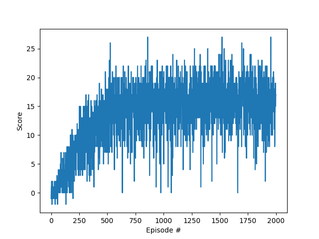
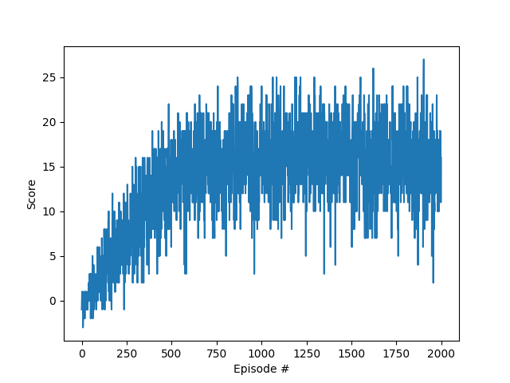

## Project 1: Navigation Report

### Algorithm

The project uses deep reinforcement learning to train an agent that solves the Unity Banana Collector game. It leverages the Deep Q-Network (DQN) method, whereby the action value function is modeled by a feedforward neural network with one hidden layer. The input layer takes in the state vector and, the output layer is a linear layer outputting the state-action values. In evaluation, the action with the highest state-action value as predicted by the model is chosen as the next action given the current observed state.

The learning algorithm keeps two sets of models. One is called the local model and is used to generate the current state action-value and participate in back-propagation; its weights are updated in every learn iteration. The second is called the target model and is used to infer the Temporal Difference (TD) target; its weights are updated at a slower rate than the local model, subject to hyperparameter calibration. The separation of the TD target from the current action-value prediction is to stabilize the DQN as a whole.

A separate Double Q-Learning method is also implemented, whereby the action chosen for the TD target uses the local model and the TD target action-value estimation uses the target model. This is called Double Q-Learning.

Instead of using the most recent set of state-action-reward-next state to perform the learn, DQN has a Replay Buffer whereby the sequence is first stored in the buffer. During learn, a batch of sequences is chosen at random from the buffer. The Replay Buffer is FIFO circular.

If prioritized replay is enabled, the random choosing of the replay batch is weighted by the absolute TD error when the sequence is first added.

### Hyperparameters

The following hyper-parameters have been shown to work well during training.

# Global hyperparameters

BUFFER_SIZE = int(1e5)          # replay buffer size
BATCH_SIZE = 64                 # replay minibatch size
GAMMA = 0.99                    # discount factor in TD control
TAU = 1e-3                      # for soft update of target parameters
LR = 5e-4                       # learning rate 
UPDATE_EVERY = 4                # how often to update the network

EPS_START = 1.0                 # Starting exploration factor
EPS_END = 0.01                  # Ending exploration factor
EPS_DECAY = 0.995               # Rate of anealing of exploration factor

USE_DOUBLE_Q = True             # Whether to use Double DQN
USE_PRIORITIZED_REPLAY = False  # Whether to use prioritized replay (enabling it can be slow for large BUFFER_SIZE)
PRIORITIZED_REPLAY_ALPHA = 0.5  # Power to the prioritized replay probability

N_EPISODES = 2000               # Max number of training episodes
MAX_T = 1000                    # Max number of actions per episode
VICTORY_SCORE = 20              # Threshold of score's running average for ending training

### Results

#### DQN vs Double DQN

Double DQN is slightly more stable than DQN and reaches the steady-state score (around 16) faster than DQN.

##### DQN Scores

##### Double DQN Scores

#### Prioritized Replay

With prioritized replay, I set the alpha to be 0.5. However, the running time with priority replay enabled is significantly longer as episodes grow and the buffer content increases. Overall, I didn't see any advantage of having prioritized replay enabled for this game. This makes intuitive sense since the most probable sequence is that associated with collecting a blue banana, but to avoid a blue banana is relatively simple compared to collecting a yellow banana.

### Improvements

1. Through trial and error, I found that if the agent is trained starting from a rather sparse corner of the world, it has trouble generalizing the results when it gets to a busy region. The agent becomes unstable and rapidly switches between all the control actions.\
It would benefit if the seed of the environment can be specified at every reset.

2. Since an action may not show benefit until many states down the road, it may benefit from storing a horizon of sequences and retrieving the batch in the fixed order.

3. The current reward system only rewards and penalizes when a banana is collected. We can attempt to adjust the reward system by also penalizing the number of actions.